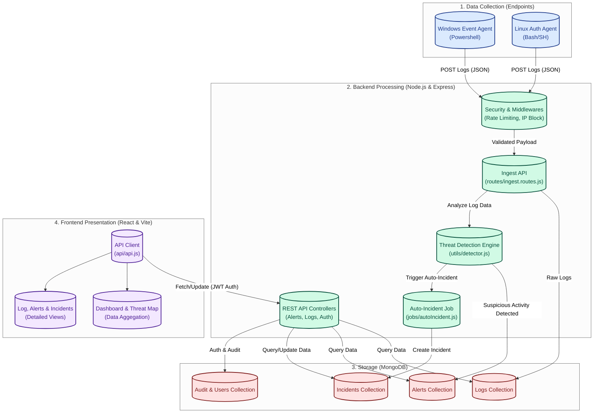

# SOC SIEM Dashboard Data Flow

This document outlines the data flow architecture for the project, detailing how log data moves from endpoint agents through the backend processing pipeline and finally to the frontend presentation layer. This is perfect for inclusion in an internship project report.

## Data Flow Diagram

## Flow Breakdown

### 1. Data Collection (Agents)
Endpoint scripts (`windows-event-agent.ps1` and `linux-auth-agent.sh`) monitor OS-level events and send formatted JSON payloads to the backend's ingestion endpoints.

### 2. Ingestion & Processing
The request hits the Express backend and passes through middleware for security (Rate Limiting, IP Blocker). The raw log is stored in the database, while simultaneously being passed to `utils/detector.js` where security rules are applied.

### 3. Alert & Incident Generation
If `detector.js` flags suspicious activity, it generates an **Alert**. Automated workers (`jobs/autoIncident.js`) then group critical alerts into structured **Incidents** for investigation.

### 4. Data Presentation
The React frontend securely requests this processed data via the REST API controllers (authenticating with JWT and RBAC). The UI populates the charts on the Dashboard, draws geospatial data on the Threat map, and lists the actionable Alerts and Incidents for SOC analysts to review.
