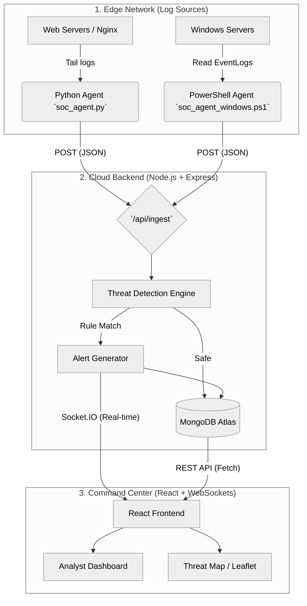
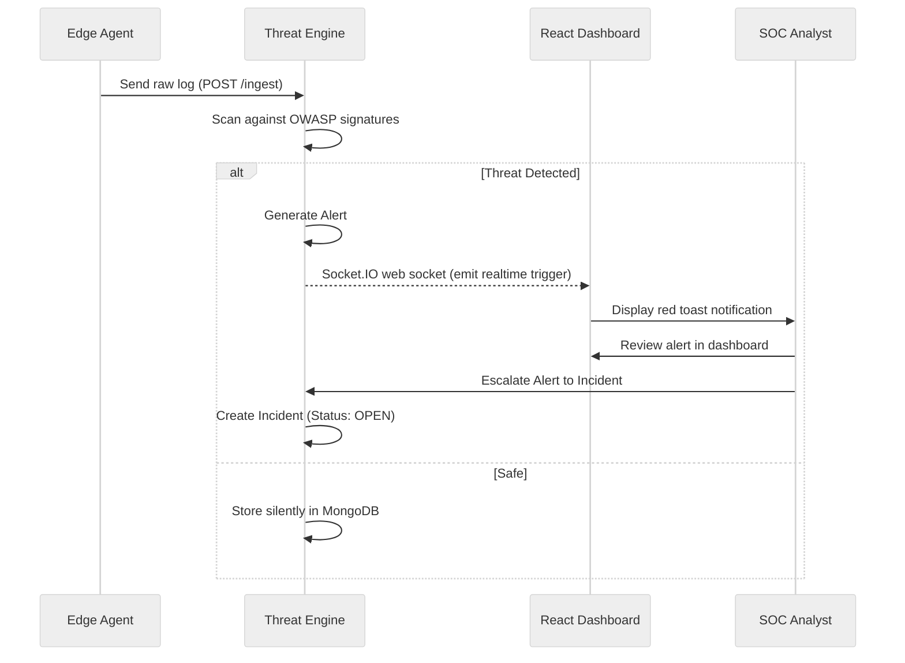

# 🏛️ Architecture & Project Structure: SOC Command Center

---

## 1. High-Level System Architecture



---

## 2. Directory Structure

### Root Directory
```text
soc-siem-dashboard/
├── backend/                  # Node.js + Express API & Brain
├── frontend/                 # React.js + Vite UI
├── docs/                     # Agents, Guides, and Architecture
├── auto_commit.ps1           # Git automation script
├── DEVELOPMENT_LOG.md        # Daily work log
├── PROJECT_PRESENTATION.md   # Presentation script & tech deep-dive
└── README.md                 # Public high-level repository overview
```

### Backend Structure (Core Engine)
```text
backend/
├── controllers/              # Business logic (handle requests)
│   ├── auth.controller.js
│   ├── log.controller.js
│   ├── alert.controller.js
│   └── incident.controller.js
├── models/                   # MongoDB Mongoose schemas
│   ├── User.js
│   ├── Log.js
│   ├── Alert.js
│   └── Incident.js
├── routes/                   # API Endpoints
│   ├── auth.routes.js
│   ├── log.routes.js
│   ├── alert.routes.js
│   ├── incident.routes.js
│   └── ingest.routes.js      # Endpoint for Agents
├── middlewares/              # Express interceptors
│   ├── auth.middleware.js    # JWT verification
│   ├── rbac.middleware.js    # Role-based access control
│   ├── rateLimiter.js        # DDoS protection
│   └── auditLogger.js        # User action tracking
├── utils/                    
│   └── detector.js           # Core Threat Detection Logic
├── config/
│   └── db.js                 # MongoDB connection
└── server.js                 # Express Entry Point
```

### Frontend Structure (React UI)
```text
frontend/src/
├── api/                      # Axios instance config
│   └── api.js
├── auth/                     # Authentication views & logic
│   ├── Login.jsx
│   └── ProtectedRoute.jsx
├── components/               # Reusable UI parts
│   ├── CyberBackground.jsx   # Animated canvas
│   ├── Navbar.jsx
│   ├── Footer.jsx
│   └── ThreatMap.jsx         # Leaflet real-world map
├── context/
│   ├── AuthContext.jsx       # Global state for user session
│   └── TransitionContext.jsx # Global UI transitions
├── pages/                    # Main routing views
│   ├── Dashboard.jsx         # KPIs, Charts, Map
│   ├── Alerts.jsx            # Alert management
│   ├── Logs.jsx              # Terminal-style explorer
│   ├── AuditLogs.jsx         # History tracking
│   └── Incidents.jsx         # Incident lifecycle management
├── styles/                   # CSS System
│   ├── index.css             # Theme variables & typography
│   ├── App.css               # Component layout
│   └── auth.css              # Cyberpunk login visuals
├── App.jsx                   # React Router hub
└── main.jsx                  # React Entry Point
```

---

## 3. Incident Escalation Flow


